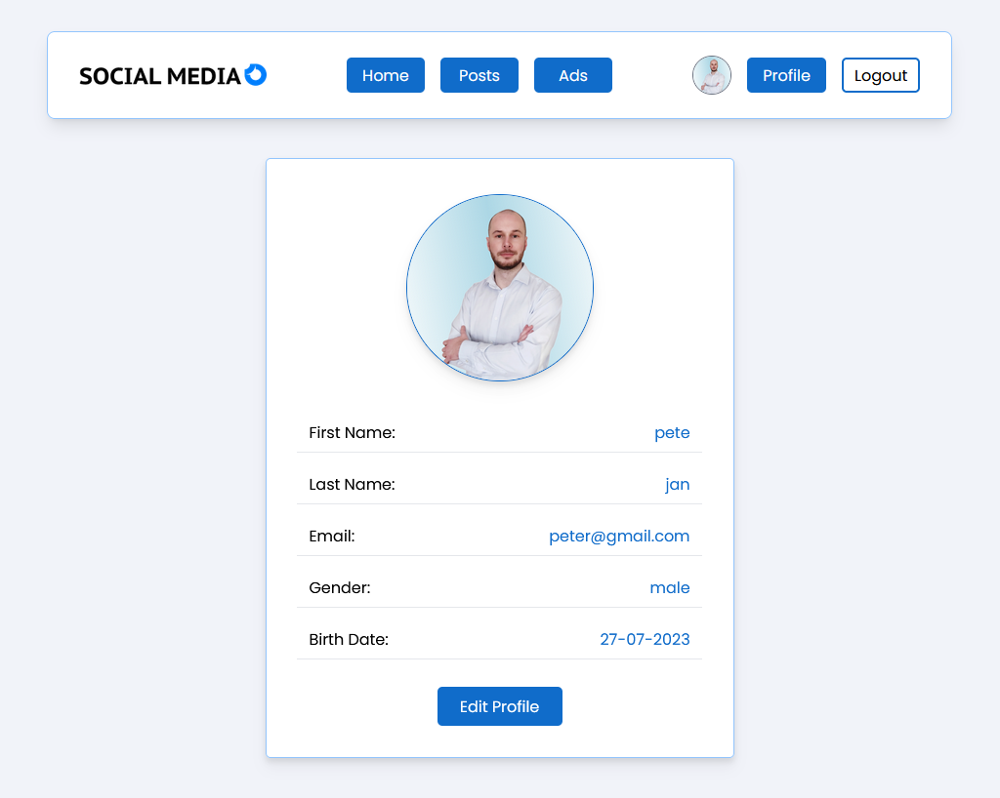
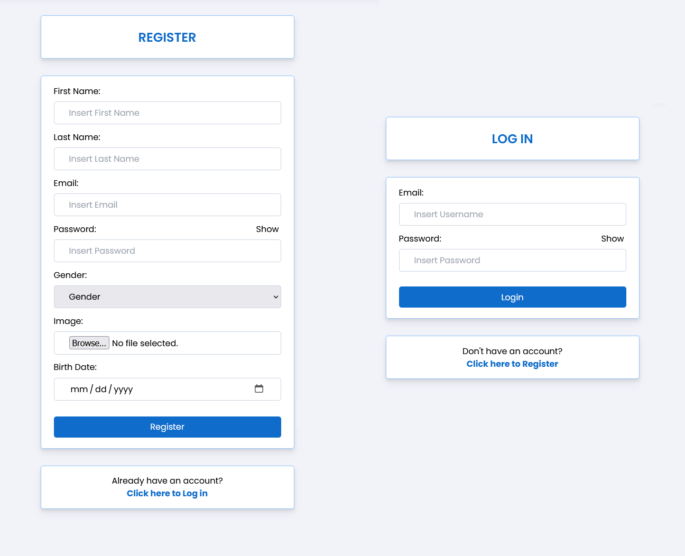

# React - Login and Register form

# 🔗 [Live Preview]()

---
## About 👋

This exercise is a small part of a much larger project meant to create a generic social media site. However, in this exercise, I am only practicing Register/Log-in/Log-out forms. All the other pages will be missing.

The backend is completely done by someone else and included in the project. My focus was strictly on Frontend. This means there is a database of registered users.

__How to start__

- You will need to open two terminals, one in the backend folder and one in the frontend. Then run the command in both separate terminals "npm i" to install packages, then again in both separate terminals run the command "npm start". This means the backend server (localhost:4000) will start and allow Registration and Logging in/out, and the Frontend server (localhost:3000) will display pages and allow interaction.

---

## Features 👨‍💻

* Register using the form. All fields are required (this was done for testing purposes).

* Login using your newly registered account.

* View your profile info (editing not included).

* Log out and Log in with different users.

* Toggle show or hide password.

---

## To skip Register form simply copy/paste already registered user:

### __peter@gmail.com__

### __pass: 1111__

---

## Languages

* MondoDB: database
* React: hooks, states, conditionals, global states....
* Tailwing: for styling